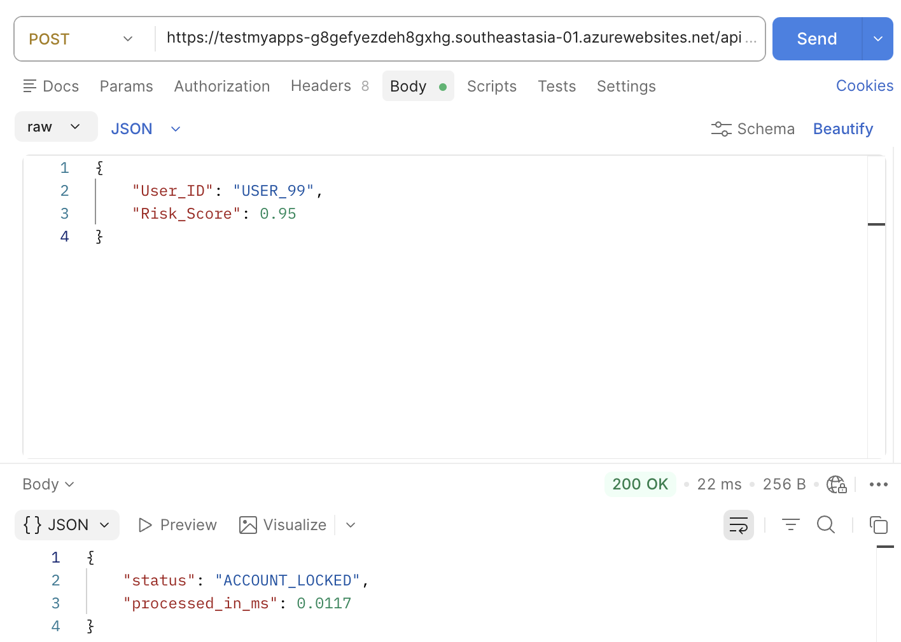

# ADR-001: 放弃 RPA GUI 路径，执行 API-First 实时拦截

* **Status:** Accepted
* **Date:** 2026-03-05
* **Decider:** Liu Shengwei

## 1. 背景与上下文 (Context)
在金融欺诈防御场景中，核心银行结算网关（Core Banking Gateway）通常存在严格的 **50ms 硬性超时**。现有的行业方案多采用 UIPath 等 RPA 工具。这些工具需要通过 GUI 模拟人工点击来执行账户冻结，其实测延迟通常在秒级，导致“预测到了欺诈，但资金已离境”的语义失明。

## 2. 决策 (Decision)
我决定彻底抛弃视觉依赖（Visual Dependency），执行 **API-First 架构策略**：
1. **剥离 GUI:** 移除所有 UiPath 模拟点击层。
2. **后端直连:** 推理引擎得出 `Risk_Score >= 0.90` 后，直接调用 Azure Functions 触发银行底盘的 REST API 执行锁定。
3. **预热机制:** 在全局空间加载模型资产，消除 Serverless 函数的冷启动开销。

## 3. 物理影响 (Consequences)
* **延迟突破:** 整体链路延迟从原来的 >1000ms 暴降至 **22ms**，成功切入 50ms 的物理死线。
* **系统稳定性:** 避开了 GUI 渲染带来的不可预测性错误。
* **代价:** 放弃了非技术人员的可视化操作流程，合规审计改为基于底层的日志流（Logging Stream）。

## 4. 验证证明 (Evidence)
* 压测环境: Azure Function (Consumption Plan)
* 验证工具: Postman
* 结果: 稳定返回 22ms。
